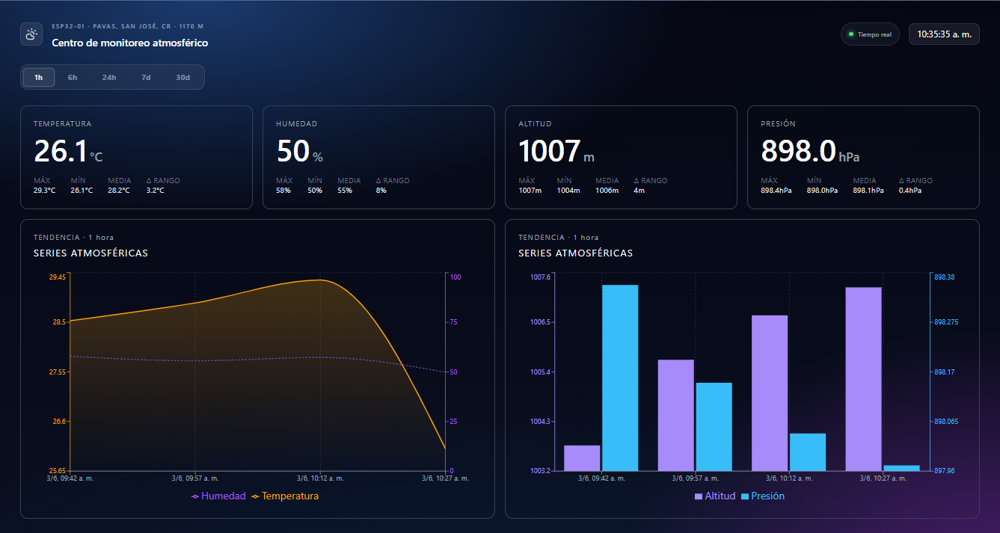

# Weather Station Dashboard

🔗 **Live demo:** https://weather-station-dashboard-hazel.vercel.app



Real-time dashboard for an IoT weather station built with an **ESP32 + BME280** sensor. Streams live readings from Firebase Realtime Database and renders them as metric cards and trend charts.

## Features

- Live sensor readings: temperature, humidity, atmospheric pressure, and altitude
- Time range filter: 1h, 6h, 24h, 7d, 30d
- Trend charts: temperature & humidity (area/line), pressure & altitude (bar)
- Downsampled chart data to keep rendering performant across longer ranges
- Device metadata panel and real-time clock
- Loading skeleton while data is fetching

## Tech Stack

| Layer | Technology |
|---|---|
| UI | React 19 + TypeScript 6 |
| Build | Vite 8.x |
| Styling | Tailwind CSS v4 |
| Charts | Recharts 3.x |
| Database | Firebase Realtime Database (SDK 12.x) |
| Testing | Vitest + Testing Library |
| CI | GitHub Actions |
| Package manager | pnpm |

## Getting Started

### Prerequisites

- Node.js 20+
- pnpm
- A Firebase project with Realtime Database enabled
- An ESP32 device writing readings to Firebase under `readings/<DEVICE_ID>`

### Installation

```bash
pnpm install
```

### Environment Variables

Create a `.env` file at the project root:

```env
# Firebase web config
VITE_FIREBASE_API_KEY=
VITE_FIREBASE_AUTH_DOMAIN=
VITE_FIREBASE_DATABASE_URL=
VITE_FIREBASE_PROJECT_ID=
VITE_FIREBASE_APP_ID=

# Device ID to display
VITE_DEVICE_ID=

```

### Running

```bash
# Development server
pnpm dev

# Production build
pnpm build

# Preview production build
pnpm preview
```

### Testing

```bash
# Watch mode
pnpm test

# Single run
pnpm test:run
```

Tests cover services (`compute-stats`, `filter-readings`, `format-chart-data`), hooks (`useReadings`, `useDeviceMeta`), and components (`MetricCard`, `RangeFilter`).

## Data Shape

The ESP32 writes each reading to Firebase under `readings/<DEVICE_ID>/<key>` in this structure:

```json
{
  "ts": 1748900000000,
  "temp_c": 24.5,
  "humidity_pct": 58.3,
  "pressure_hpa": 1013.2,
  "altitude_m": 42.1
}
```

`ts` is a Unix timestamp in milliseconds. The dashboard queries by `ts` using Firebase's `orderByChild` + `startAt` to fetch only the selected time window.

## Project Structure

```
src/
├── components/features/   # UI components (MetricCard, TrendChart, RangeFilter, ...)
├── constants/             # Metrics config and time range definitions
├── hooks/                 # useReadings, useDeviceMeta
├── lib/                   # Firebase client initialization
├── services/              # Pure functions: stats, downsampling, chart formatting
└── types/                 # TypeScript types (Reading, TimeRange, ...)
```

## Related repos

- [weather-station-backend](https://github.com/Jake-Herrera/weather-station-backend)
- [weather-station-firmware](https://github.com/Jake-Herrera/weather-station-firmware)
